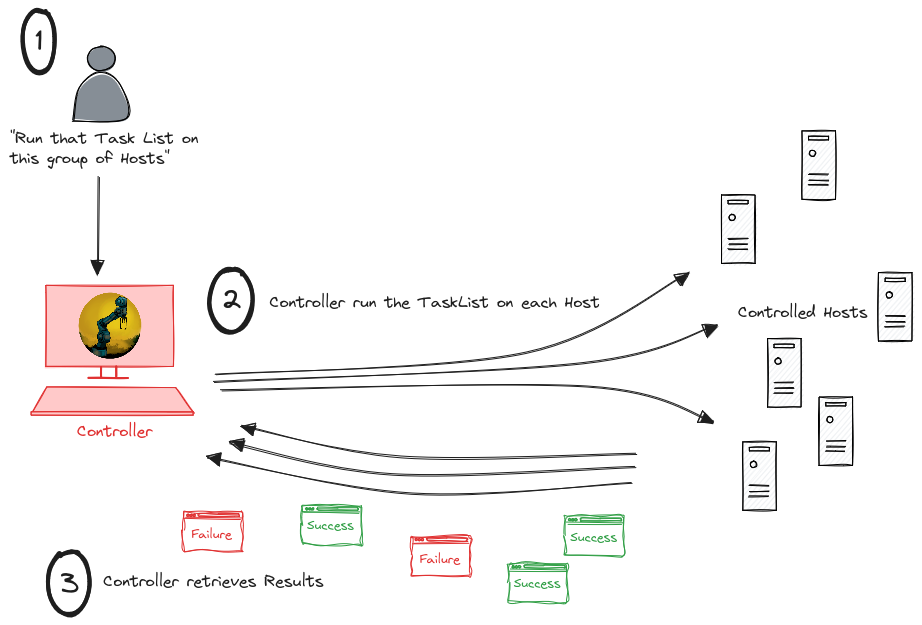
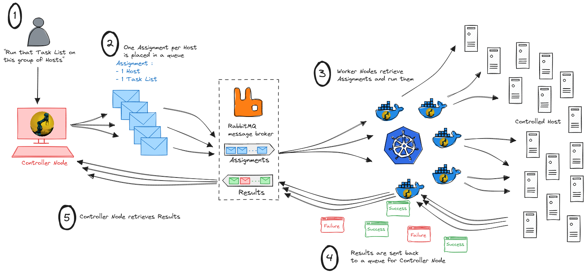
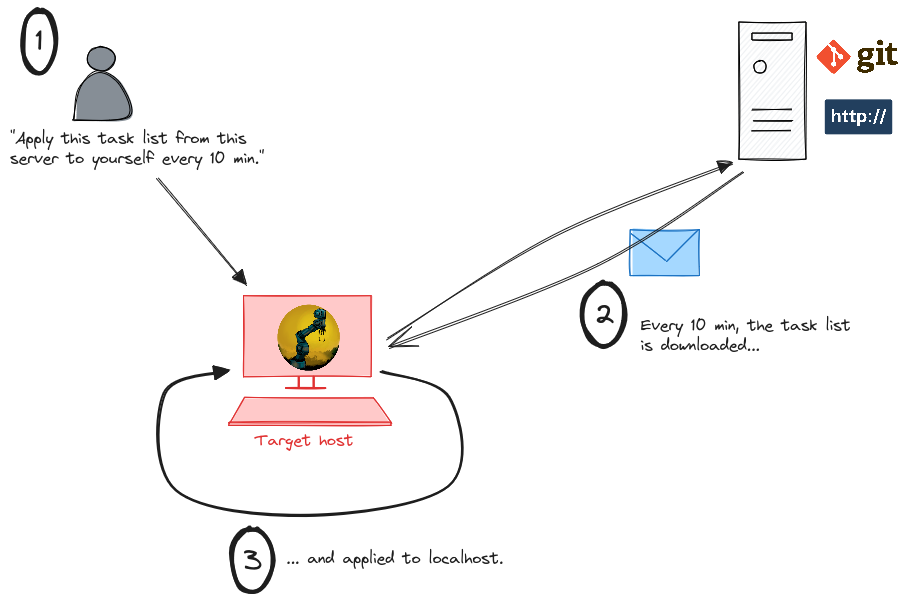

# Duxcore : embed an ansible-like automation engine right in your Rust code

<div align="center">

</div>

# The goal
Instead of having one big automation tool (meaning configuration management or orchestration tool) trying to handle all scenarios (be scalable, performant, handle local and remote hosts through this protocol or this one, be compliant with this security standard and this one...), we prefer to build one flexible automation *engine* (this crate) and make it as easy as possible to embed in a codebase already adapted to one's specific need.

# Documentation
A [*book*](https://www.dux-automate.org/book/) has been opened about the Dux project. Especially, modules list and documentation can be found [here](https://www.dux-automate.org/book/modules.html).

# Principle

Based on Rust's type system, the workflow is as follows :
1. Get a task list : what is the expected state of the managed hosts ? This step produces a `TaskList` struct.
2. Get a hosts list : which hosts are under the scope of this task list ? This step produces a `HostList` struct.
3. Generate `Assignments` : an `Assignment` represents a host and allows to track what happens to this host. It contains everything needed to handle the host and apply the expected state.
4. Dry run : dry run each `Assignment`. This step produces a `ChangeList` struct which contains what needs to be done on the host to reach the expected state.
5. Apply : actually apply the changes on the host to reach the expected state. This step produces a `ResultList` struct.


# Usage
```rust
use duxcore::prelude::*;

// Build a HostList : list of target hosts
let hostlist: Hostlist = hostlist_parser(
    hostlist_get_from_file("/path/to/my/hostlist.yaml")
);

// Build a TaskList per host (host-specific variables taken into account)
let tasklist: TaskList = tasklist_parser(
    tasklist_get_from_file("/path/to/my/tasklist.yaml"),
    &host
);

// Build an Assignment per host
let assignment = Assignment::from(
    correlationid: correlationid.get_new_value().unwrap(),
    runningmode: RunningMode::Apply, // Do we want to actually perform automation or just check the delta between what is and what we want
    host: host.address.clone(),
    hosthandlinginfo: HostHandlingInfo::from(...), // Using information about hosts, connection mode, credentials...,
    variables: HashMap::new(),
    tasklist: tasklist.clone(),
    changelist: ChangeList::new(),
    resultlist: ResultList::new(),
    finalstatus: AssignmentFinalStatus::Unset,
);

// Build a HostHandler : struct required to connect to the host
// (not included in Assignment since it's not serializable for now)
let mut hosthandler = HostHandler::from(&assignment.hosthandlinginfo).unwrap();

// Dry run the Assignment
let dry_run_result = assignment.dry_run(&mut hosthandler); // -> 

// Apply the changes required to meet the expected state of the host
let applied_assignment_result = assignment.apply(&mut hosthandler);

```


# Examples

Examples of how the Dux crate can be used are being built as separate projects. These are proofs of concept and can be used as a starting point for your own implementation. You can also start from scratch.

## Standard implementation
> One binary doing everything

Dux standard project : [https://gitlab.com/dux-tool/dux-standard](https://gitlab.com/dux-tool/dux-standard)

<div align="center">

</div>

## Scalable implementation
> Workload split between a controller and workers nodes, with a message broker in the middle to allow scaling the number of workers

Dux scalable controller project : [https://gitlab.com/dux-tool/dux-scalable-controller](https://gitlab.com/dux-tool/dux-scalable-controller)  
Dux scalable worker project : [https://gitlab.com/dux-tool/dux-scalable-worker](https://gitlab.com/dux-tool/dux-scalable-worker)

<div align="center">

</div>

## Agent implementation
> A Dux agent running as a background service, regularly fetching a remote tasklist (http/https, git...) and applying it to itself

Dux agent project : [https://gitlab.com/dux-tool/dux-agent](https://gitlab.com/dux-tool/dux-agent)

<div align="center">

</div>


# Contribution
Want some help to use this crate for your own situation ? Open to suggestions, feedback, requests and any contribution !
Will gladly exchange ideas and help you build your own implementation right [there](https://discord.com/invite/2gxAW7uzsx) !
