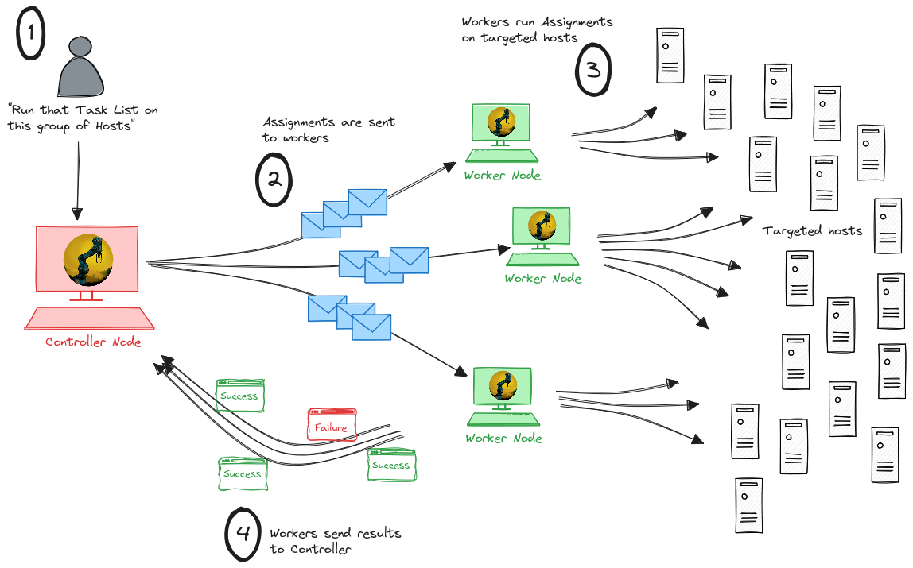

# Duxcore : embed an ansible-like automation engine right in your Rust code

<div align="center">

</div>

# The goal
Instead of having one big configuration management tool trying to handle all scenarios, we prefer to build one flexible automation *engine* (this crate) and make it as easy as possible to embed in a codebase, ready to be adapted to one's specific need.

# Documentation
A [*book*](https://www.dux-automate.org/book/) has been opened about the Dux project. Especially, modules list and documentation can be found [here](https://www.dux-automate.org/book/modules.html).

# Basic example
Import the crate

```shell
cargo add duxcore
```
Now let's perform the usual example : **setup a webserver** (but, this time, right from your Rust code !)
```rust
use duxcore::prelude::*;

fn main() {

    // First we need to define what the expected state of the target host is.
    let my_tasklist = r#"---
- name: Let's install a web server !
  steps:
    - name: First, we test the connectivity and authentication with the host.
      ping:
      
    - name: Then we can install the package...
      with_sudo: true
      apt:
        package: '{{ package_name }}'
        state: present
        
    - name: ... and start & enable the service.
      with_sudo: true
      service:
        name: '{{ service_name }}'
        state: started
        enabled: true

    - name: What date is it on this host by the way ?
      register: host_date
      command:
        content: date +%Y-%m-%d" "%Hh%M

    - name: Let's see...
      debug:
        msg: 'date: {{ host_date.output }}'
        
        "#;

    // Then we create a 'Job'.
    let mut my_job = Job::new();

    // We set who the target host of this Job is, and how to connect to it.
    my_job
        .set_address("10.20.0.203")
        .set_connection(HostConnectionInfo::ssh2_with_key_file("dux", "./controller_key")).unwrap();
    
    // We give it some context and the task list.
    my_job
        .add_var("package_name", "apache2")
        .add_var("service_name", "apache2")
        .set_tasklist_from_str(my_tasklist, TaskListFileType::Yaml).unwrap()
    ;
    // We can finally apply the task list to this host.
    my_job.apply();

    // Let's see the result.
    println!("{}", my_job.display_pretty());
}
```
Output
```json
{
  "host": "10.20.0.203",
  "timestamp_start": "2024-11-15T23:14:09.114229853+00:00",
  "timestamp_end": "2024-11-15T23:14:09.864756326+00:00",
  "final_status": "ApplySuccesful",
  "tasks": [
    {
      "name": "Let's install a web server !",
      "steps": [
        {
          "name": "First, we test the connectivity and authentication with the host.",
          "expected_state": {
            "ping": {}
          },
          "status": "ApplySuccessful"
        },
        {
          "name": "Then we can install the package...",
          "expected_state": {
            "apt": {
              "state": "present",
              "package": "apache2"
            }
          },
          "status": "ApplySuccessful"
        },
        {
          "name": "... and start & enable the service.",
          "expected_state": {
            "service": {
              "name": "apache2",
              "state": "started",
              "enabled": true
            }
          },
          "status": "ApplySuccessful"
        },
        {
          "name": "What date is it on this host by the way ?",
          "expected_state": {
            "command": {
              "content": "date +%Y-%m-%d\" \"%Hh%M"
            }
          },
          "status": "ApplySuccessful"
        },
        {
          "name": "Let's see...",
          "expected_state": {
            "debug": {
              "msg": "date: 2024-11-16 00h14\n"
            }
          },
          "status": "ApplySuccessful"
        }
      ]
    }
  ]
}
```
This is the basic workflow of Dux. The *Job* type, around which the whole automation revolves, is serializable/deserializable. It is then up to you to parallelize, distribute the work, display the results in some web interface or send the workload to workers via a message broker... Whatever suits you best ! To handle multiple hosts at once, use a [JobList](https://docs.rs/duxcore/latest/duxcore/job/joblist/struct.JobList.html) instead.

# More examples

More complex examples of how the Dux crate can be used are being built as separate projects. These are **proofs of concept** and can be used as a starting point for your own implementation. You can also start from scratch.

## Standard implementation
> One binary doing everything

Dux standard project : [dux-standard](https://gitlab.com/dux-tool/dux-standard)

<div align="center">

</div>

## Agent implementation
> A Dux agent running as a background service, regularly fetching a remote tasklist (http/https, git...) and applying it to itself

Dux agent project : [dux-agent](https://gitlab.com/dux-tool/dux-agent)

<div align="center">

</div>

## Distributed implementation
> Workload split between a controller which generates Jobs and workers which actually run them on targetted hosts

Dux distributed controller project : [dux-distributed-controller](https://gitlab.com/dux-tool/dux-distributed-controller)  
Dux distributed worker project : [dux-distributed-worker](https://gitlab.com/dux-tool/dux-distributed-worker)

<div align="center">

</div>

## Scalable implementation
> Workload split between a controller and workers nodes, with a message broker in the middle to allow scaling up and down the number of workers

Dux scalable controller project : [dux-scalable-controller](https://gitlab.com/dux-tool/dux-scalable-controller)  
Dux scalable worker project : [dux-scalable-worker](https://gitlab.com/dux-tool/dux-scalable-worker)

<div align="center">

</div>


# Contribution
Want some help to use this crate for your own situation ? Open to suggestions, feedback, requests and any contribution !
Will gladly exchange ideas and help you build your own implementation right [there](https://discord.com/invite/2gxAW7uzsx) !
